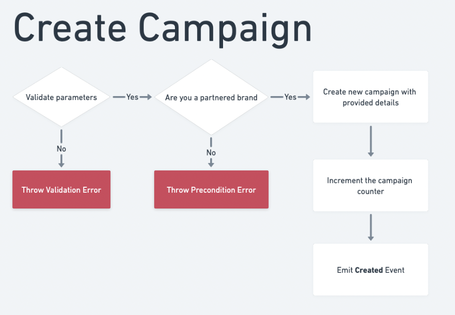
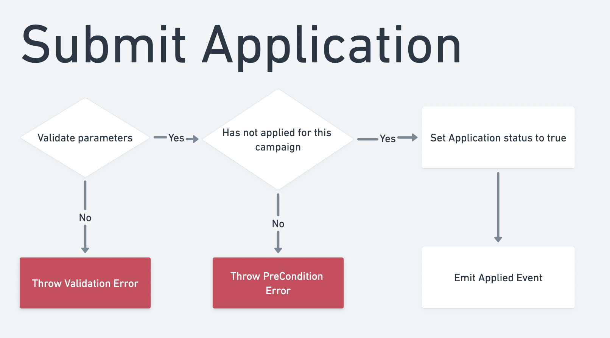

# Campaign Factory Smart Contract

The Campaign Factory smart contract is designed to streamline the management of social media campaigns by automating the process of selecting and rewarding content creators for their social media engagement. 
Brands can use the contract to create campaigns, specify the required number of likes, and set the reward for completing the campaign. Users can then apply to participate in a campaign, and the contract will select one user to complete the like goal. 
The use of a smart contract on the Ethereum blockchain ensures transparency and security for all parties involved in the campaign.

[Testnet Deployment](https://goerli.etherscan.io/address/0x8e0b7e6062272b5e023ecd2be471e95d5f7b6a8a#code) |
[Mainnet Deployment](https://etherscan.io/address/0x8e0b7e6062272b5e023ecd2be471e95d5f7b6a8a#code)

## Features
- Brands can create new campaigns and track their engagement.
- Users can apply to participate in a campaign.
- The owner of the contract can assign a user to a campaign 
  - if they have not chosen a random user is selected.
- Users can engage with a campaign by giving a like.
- When a campaign reaches its performance goal.
  - The user who participated in the campaign receives a payout.

## Roadmap
- [] Add a max application limit to campaigns, and time lock a transaction to pick a random user.
- [] Add a function to allow users to withdraw their application.

## Dependencies
[OpenZeppelin Ownable](https://docs.openzeppelin.com/contracts/4.x/api/access#Ownable) 
To manage the ownership of the Campaign Factory contract.

[OpenZeppelin Counters](https://docs.openzeppelin.com/contracts/4.x/api/utils#Counters) 
Generate unique IDs for campaigns.

## Events

| Name | Parameters | Description |
|------|------------|-------------|
| **Created** | `id` (uint256), `name` (string), `minLikes` (uint256), `endDate` (uint256), `timestamp` (uint256) | Emitted when a new campaign is created |
| **Applied** | `id` (uint256), `user` (address), `timestamp` (uint256) | Emitted when a user applies to participate in a campaign |
| **Assigned** | `id` (uint256), `user` (address), `timestamp` (uint256) | Emitted when a user is assigned to a campaign |
| **Liked** | `id` (uint256), `user` (address), `timestamp` (uint256) | Emitted when a user likes a campaign |
| **Finished** | `id` (uint256), `user` (address), `payout` (uint256), `timestamp` (uint256) | Emitted when a campaign is finished |
| **BrandAdded** | `brand` (address), `timestamp` (uint256) | Emitted when a brand is added to the whitelist |
| **BrandRemoved** | `brand` (address), `name` (string) `description` (string) `timestamp` (uint256) | Emitted when a brand is removed from the whitelist |

## Functions

### Create 

This function allows a brand to create a new campaign. 
It takes in several parameters: 

- A name for the campaign, 
- A description,
- An image, 
- The minimum number of likes needed to finish the campaign, 
- Length of time the campaign will be active for. 

we then perform several checks to ensure that the input data is valid, such as making sure that the

- Active time and minimum likes are positive values
- Name is not an empty string
- user sent a positive amount of tokens. 

If any of these checks fail, the function reverts. 
If the checks pass, a new campaign is created and added to the campaigns mapping with a unique ID. 
The counter keeping tracks of campaigns is incremented. 
And we fire the  **Created** event with relevant details about the new campaign.

### Submit Application

This function allows users to apply to participate in a campaign. 
It takes one parameter, the ID of the campaign.

To be eligible to apply, the following conditions must be met:

- The campaign must exist
- The status of the campaign must not be `ACTIVE`
- There must be time left on the campaign
- The user must not have already applied for the campaign

If any of these conditions are not met, the function will revert.
If the user is eligible to apply, the we will set your applied status to true and fire the **Applied** event.

### Review Application 

This function is used to accept a user's application to participate in a campaign. 
It is called by the contract owner and requires two parameters: 

- the ID of the campaign 
- address of the user being accepted. 

we first check if the user has applied to the campaign. 
If the user has not applied, it reverts with the UserHasNotApplied error.
If the user has applied, the function updates the campaign's status to ``Active and assigns the user to the campaign. 
Finally we delete the user's application and emit the **Assigned** event. 

